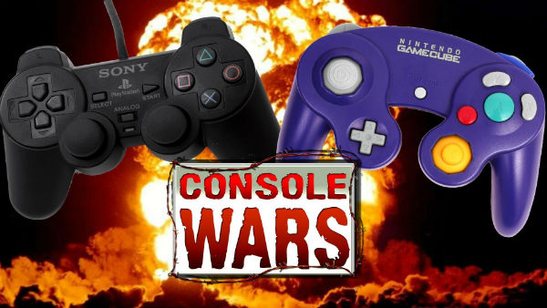

# Gamecube vs. PS2

In this app we will be debating which early 2000s console is better. The PlayStation 2 by Sony or the GameCube by Nintendo.

## Requirements

All you will need is a modern web browser as well as git installed locally.

## Installation 

<code> Simply CD to the directory you wish to install on and git clone! </code>

## Authors 

<ul>
	<li>Quinn McHugh - Debating for Gamecube</li>
	<li>Carter Geerts - Debating for PlayStation 2</li>	
	<li>Matthew Coulter - Read me author/ Closing remarks</li>
</ul>

